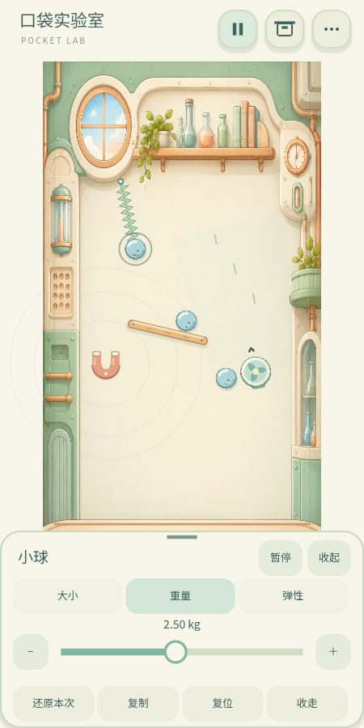

# Pocket Lab · 口袋实验室

**给无处安放的两分钟一个地方。**

一个已经用 Godot 4.6 运行验证的本地二维物理沙盒 MVP。进入就是桌面，可以拖、抛、搭建；没有账号、关卡或网络依赖。动态小球、胡克弹簧、固定挡板、磁场和定向风场在同一个物理系统中作用。

当前版本 **0.3.2 · 物理回退版**：物理模块及木板移动恢复 v0.3 行为，撤回 v0.3.1 的空气/滚动损耗、弹性映射与木板扫掠推力。保留属性栏打开时自由拖动、长按切换目标和整轮撤销，其他界面与音效不变。详见 [回退说明](docs/REVISION-V032.md)。



## 立即运行

当前工作目录已下载便携 Godot 到 .tools/godot，**双击 Run-PocketLab.cmd 即可打开**，也可在 PowerShell 执行：

```powershell
cd '<PROJECT_DIR>'
.\Run-PocketLab.ps1
```

也可以直接用 Godot 4.6 Standard 导入 project.godot，按 F6/F5 运行。源代码压缩包不附带引擎；其他电脑先安装 Godot，再指定路径：

```powershell
.\Run-PocketLab.ps1 -GodotPath '<GODOT_EXECUTABLE>'
.\Run-PocketLab.ps1 -GodotPath '<GODOT_EXECUTABLE>' -Editor
```

无需 npm、Python、数据库或 API Key。首次导入会建立 .godot 缓存，之后可离线启动。Windows 鼠标操作与手机单指触控共用交互逻辑。

## 怎么玩

- 第一次打开就是一颗弹簧小球和木板；有存档时继续原场景。直接拖动、松手抛出。
- 底部“展开”打开工具抽屉，拖出道具或轻点添加；“收起”留出更多画面。
- 长按道具约半秒，打开底部小面板。点参数标签，拖滑块或按加减，画布中的物体实时改变；模拟继续，也可以主动暂停。
- 属性栏打开时，画布仍可拖动和抛出物体；拖其他物体不切换属性，长按另一物体才切换。调参和试拖合并为一次撤销。
- “方向”标签旋转木板、风扇和磁铁；复制、复位、收走在面板底部。普通点选不弹操作栏。
- “收起”或向下拖面板顶部把手，保留修改；“还原本次”恢复进入面板时的整个实验快照。一轮参数修改只占一步撤销。
- 弹簧工具依次选择两个端点，至少一个为小球；空白处创建锚点。长按弹簧可调节或解除连接。
- 顶部暂停、作品盒和设置；底部撤销、重新组合。设置中可以清空、整体复位、恢复重新组合前的场景。
- 声音默认关闭；开启后只有稀疏的材质碰撞声，风扇不持续发声。声音与触觉独立开关。
- “随手机轻动”默认开启，支持设备上轻倾手机影响动态球，轻晃产生有限冲量。拖动/编辑时抑制；关闭后回到纯触摸玩法。电脑无传感器时自动降级。
- 每约 2 秒和切后台保存；作品保存在本机，最多 40 件，核心无需联网。

## 目录

```text
Pocket Lab开发/
├── project.godot                 Godot 配置/物理/竖屏/碰撞层
├── export_presets.cfg            Android 与 Windows 导出预设
├── Run-PocketLab.ps1             启动/打开编辑器
├── Run-PocketLab.cmd             当前电脑双击运行入口
├── Test-PocketLab.ps1            导入及回归测试
├── scenes/lab.tscn               唯一主场景
├── content/desktop.json          核心内容包及默认参数
├── content/desktop_theme.json    实验室主题资源与材质映射
├── scripts/
│   ├── app.gd                   操作、会话、撤销、生命周期
│   ├── hud.gd                   触控界面与本地作品/设置
│   ├── world.gd                 物理世界、弹簧图、状态还原
│   ├── lab_body.gd              刚体、拖拽、序列化
│   ├── device_motion.gd         传感器校准、滤波、限幅与冷却
│   ├── fields.gd                磁场与风场
│   ├── item_art.gd              程序化道具外观
│   ├── lab_theme.gd             实验室配色与面板绘制
│   ├── property_schema.gd       属性范围、格式与效果说明
│   ├── catalog.gd               配置访问
│   ├── generator.gd             种子与模板生成
│   ├── storage.gd               本地写入、校验、备份
│   └── feedback.gd              音效池、冷却、触觉适配
├── assets/                      原创图标、离线字体及许可
├── tests/                       物理/触控/保存回归及结果 JSON
├── docs/
│   ├── TECHNICAL.md             产品技术方案、模块、风险
│   ├── MOBILE.md                Android 导出与 iOS 适配
│   └── preview-v3.png / properties-v3.png 实际引擎画面
└── builds/                      构建与源代码归档输出
```

Godot 自动生成 .uid、.import 文件用于资源追踪；.godot 缓存和 .tools 引擎不属于源代码包。

## 已实现

五种道具的真实组合物理；拖出、拖动、抛出；面板旋转、复制、复位、删除；弹簧创建/解除；实时物理参数编辑、碰撞空间校验、整轮还原与撤销；暂停、清空；24 步撤销；实验室插画与卡通道具；分材质碰撞声与独立触觉；自动保存、备份回退、本地作品、种子生成、上一组合快照；安全区适配、容量限制和性能调试；有限幅度的设备运动输入。

## 实际验证与限制

Godot 4.6 Windows 完成脚本导入、实际渲染和集成测试。基础回归 **8282 项、0 失败**；第二版交互/传感器算法回归 **157 项、0 失败**。涵盖 450 个种子/尺寸组合、48 球混合物理、真实 Viewport 触摸事件、实时滑块与撤销、防误触、几何碰撞限制、同风力不同质量、面板下滑、800/1000 高度视图和后台恢复。传感器算法以合成读数测试，不能代替手机测试。完整执行：

```powershell
.\Test-PocketLab.ps1
```

测试使用独立 user://tests 目录，不覆盖正常作品。无头加速仿真不能证明手机 FPS。**本次没有 Android SDK、导出模板或真机，未生成 APK，也没有声称 Android/iOS 安装验证。** 完整步骤与待测表在 [MOBILE.md](docs/MOBILE.md)。

手机温控/安全区/真实后台杀进程/音色与触感仍需真机验收。极密结构、快速挪动固定物体、缩屏后的重叠仍有调优空间。当前尚无作品重命名/删除管理、完整无障碍语义和屏幕阅读器支持。未开发任何明确排除的商业/社交/AI 功能。

Windows 默认本地数据位于 `%APPDATA%\PocketLab`；开发时备份该目录即可保留作品。卸载手机 App 通常会删除其本地数据。

进一步说明：[技术设计与风险](docs/TECHNICAL.md)、[移动端导出与测试](docs/MOBILE.md)、[资源许可](assets/NOTICE.md)。


## 隐私与本地配置

公开源码使用下列占位符，不包含开发者的实际配置值。运行示例前请替换占位符；不要把真实值提交回仓库。

| 标识 | 含义与填写位置 |
| --- | --- |
| `<PROJECT_DIR>` | 你本机克隆项目的目录；也可以直接在仓库根目录打开终端。 |
| `<GODOT_EXECUTABLE>` | 本机 Godot 可执行文件路径，通过 `-GodotPath` 参数传入。 |
| `<GITHUB_NOREPLY_EMAIL>` | GitHub Settings → Emails 提供的隐私提交邮箱，用于本机 Git user.email。 |
| `<LOCAL_SIGNING_CREDENTIALS>` | 正式打包所需的密钥、密码和证书；只在本机导出凭据或安全的 CI Secrets 中设置，本项目不提供真实值。 |

已移除文档中的开发机项目绝对路径；当前公开分支的提交使用 GitHub noreply 邮箱。项目中的 `res://`、`user://`、`.godot/imported/` 是 Godot 资源/用户目录标识，不是开发者个人路径。公开 GitHub 用户名和 LICENSE 中的版权署名、第三方字体许可证保留，用于合法归属说明。

`.gitignore` 排除了引擎缓存、构建归档、环境变量文件、签名材料、导出凭据和常见本地场景存档。字体与插画为应用资源；文档 PNG 为应用画面截图，本轮检查未发现个人资料或文本元数据。测试 JSON 为合成测试结果，不是用户作品。

核心玩法不需要 API Key 或联网服务。隐私检查属于当前版本的静态检查，不是对未来提交的绝对保证。若真实令牌或密钥曾被公开，应立即撤销/轮换；删除文件或改写分支不能保证 GitHub 缓存、旧提交链接或他人的克隆同步消失。
