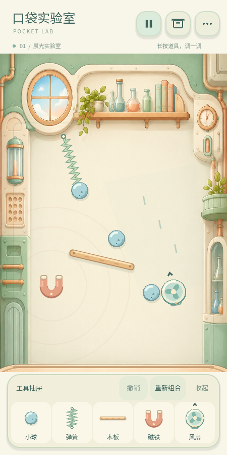
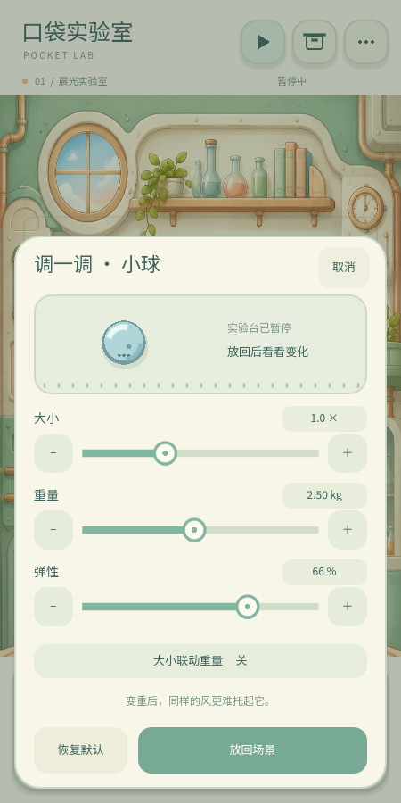

# 0.2.0 · 初步修改版

本轮把实验室背景、道具和 UI 统一为暖白/薄荷绿的卡通实验室，并加入长按物理属性编辑。只修改现有实验室，未扩展沙漠、水体、瀑布或商业系统。

## 现在可以直接体验

双击项目目录 `Run-PocketLab.cmd`。工具抽屉仍支持拖出/点击添加；直接拖动场景内道具，长按约 0.48 秒出现属性面板。长按有进度圆环，移动超过阈值转为拖拽，第二根手指不接管当前操作。

轻点选中后，底部只浮出“调一调、复制、复位、收走”。木板、风扇、磁铁旁出现旋转把手，单指绕物体拖动即可旋转；旋转在物理步内限速并检查场景边界。暂停在顶部；撤销、重新组合在抽屉；清空移至设置。

## 长按 → 调整 → 放回场景

属性面板会暂时暂停实验；滑块/加减按钮只改草稿和预览。“放回场景”后才一起更新物理与外观；取消不改原物体。原本暂停的场景在结束编辑后继续保持暂停，原本运行的场景恢复运行。

| 道具 | 参数 | 生效结果 |
| --- | --- | --- |
| 小球 | 半径 10–30、质量 0.25–5 kg、弹性 0.1–0.9 | 外观/碰撞圆同步、真实刚体质量/惯量更新、碰撞回弹改变 |
| 木板 | 长度 80–200、厚度 8–30、摩擦 0.1–1 | 绘制和碰撞矩形同步，改变轨迹与滑动阻力 |
| 风扇 | 力 0–2400、距离 120–320 | 风场真实变化，叶片/风线/运行声跟随强度，零风力停转 |
| 磁铁 | 力 0–2200、范围 80–220 | 真实吸引力及可视化范围同步 |
| 弹簧 | 自然长 30–400、刚度 10–65、阻尼 1–12 | 更新原连接，改变伸长与振荡 |

表中尺寸为内部场景单位；用户面板用相对倍数表达尺寸/范围，用百分比表达强度。质量用 kg。大小默认按球体体积比例联动质量（立方关系，受质量范围限制）；手动调整质量会解除联动，可单独做“大而轻”的球。小球表面的点标记帮助辨认相对重量，不改变碰撞形状。

参数修改可以撤销，复制会保留调好的属性，自动存档与作品保存包含这些值。“恢复默认”也只改草稿，需要再按放回才生效。

放大时通过 Godot 形状查询检测碰撞和边界。原位置不合适时，在约 40 个场景单位内尝试小幅调整位置；找不到空间则保持面板、提示缩小，原物体和撤销栈都不改变。未实现任意远处的重新选位。

## 场景、美术与声音

原创实验室插画 `assets/lab-room-v2.png` 使用内置 image_gen 生成并打包离线，原始提示词见 ART-V2.md。道具独立程序化绘制，可随尺寸改变、真实旋转，不把静态背景当可交互对象。暖白设备外壳、木色边缘、薄荷绿按钮与淡蓝小球形成同一实验室语言。当前只有这一套实验室主题；尚未制作其他场景的皮肤。

金属球撞木板/实验台、撞其他金属、撞塑料风扇分别触发不同合成音色；响度参考速度和质量。磁铁吸附附近和明显弹簧活动有冷却反馈。风扇使用一个共享、限音量的循环声，随总风力调整；碰撞等短音仍使用 4 个音源池。默认静音，触觉独立开关。素材是合成声，尚未经过手机扬声器/耳机的主观音质验收。

## 数据与兼容

保留 version=1 的向后兼容字段，老木板没有 thickness 时补为 14。输入参数范围会校验，错误数据回退备份。序列化属性使用深拷贝，避免快照、原物体、复制品和编辑草稿互相修改。

属性面板的临时暂停不会落盘成用户主动暂停，未应用的草稿不会写入场景。切后台后继续保持编辑暂停；关闭编辑再恢复之前的运行状态。恢复连接图时允许弹簧处于瞬时压缩状态，不因两端暂时很近而丢失合法连接。

## 验证结果

- 原有集成回归：8282 检查，0 失败。
- 修改版回归：1659 检查，0 失败；包括真实 Viewport 输入管线中的触摸长按、滑块、取消、旋转，参数应用/撤销/复制、空间不足、材质声差异、后台编辑状态和旧存档兼容。
- 同风扇条件下，12 个物理步后，1 kg 小球纵向速度约 -22.99（向上），3 kg 小球约 +69.57（向下）。验证的是通过属性面板提交后的真实刚体反应。
- 24 个轻重/尺寸混合小球与强力磁铁、风扇、粗木板、硬弹簧运行 900 步，抽样有限状态和边界检查通过。
- 两个独立 Godot 进程的写入/重新启动读取测试通过。
- 450×900、450×800、450×1000 实际渲染截图已生成，用于桌面比例检查。

运行 `Test-PocketLab.ps1` 复现。**没有生成 Android APK，也没有手机真机验证。** Android/iOS 导出环境和验收仍见 MOBILE.md。普通手机性能、真实安全区域、长按手感、音质与振动强度需要真机确认。

当前限制：尺寸调整只允许附近安全放置；任意拥挤结构的旋转仍需手感调优；未提供自定义道具预设库、作品重命名/删除、完整无障碍界面。字体是本轮文案子集，增加文字时需要更新字体子集。
